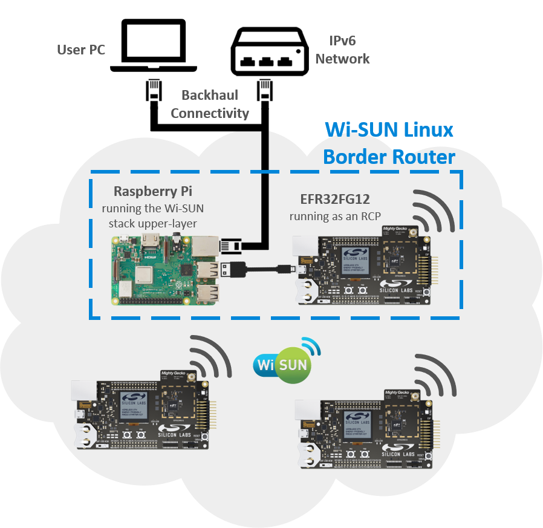

# Wi-SUN - RCP Border Router

The Wi-SUN RCP Border Router application is a radio coprocessor implementation that has to be paired with a Linux host running the Wi-SUN stack upper layers (i.e., wsbrd).

## Getting Started

To get started with Wi-SUN and Simplicity Studio, see [QSG181: Wi-SUN SDK Quick Start Guide](https://www.silabs.com/documents/public/quick-start-guides/qsg181-wi-sun-sdk-quick-start-guide.pdf).

The RCP term stands for "radio coprocessor", meaning the application runs on the EFR32 and requires an external Linux host. The Linux host has to run the [wsbrd daemon hosted on GitHub](https://github.com/SiliconLabs/wisun-br-linux). Using both the linux host and the EFR32 running the RCP image, the aim is to create a Wi-SUN border router that can scale to support large network deployments.

To have an advanced overview of the Wi-SUN Linux Border Router, refer to the [AN1332: Wi-SUN Network Setup and Configuration](https://www.silabs.com/documents/public/application-notes/an1332-wi-sun-network-configuration.pdf).

## Troubleshooting

Before programming the radio board mounted on the WSTK, ensure the power supply switch is in the AEM position (right side), as shown.

## Resources

* [Wi-SUN Stack API documentation](https://docs.silabs.com/wisun/latest)
* [AN1330: Wi-SUN Mesh Network Performance](https://www.silabs.com/documents/public/application-notes/an1330-wi-sun-network-performance.pdf)
* [AN1332: Wi-SUN Network Setup and Configuration](https://www.silabs.com/documents/public/application-notes/an1332-wi-sun-network-configuration.pdf)
* [AN1364: Wi-SUN Network Performance Measurement Application](https://www.silabs.com/documents/public/application-notes/an1364-wi-sun-network-performance-measurement-app.pdf)
* [QSG181: Wi-SUN Quick-Start Guide](https://www.silabs.com/documents/public/quick-start-guides/qsg181-wi-sun-sdk-quick-start-guide.pdf)
* [UG495: Wi-SUN Developer's Guide](https://www.silabs.com/documents/public/user-guides/ug495-wi-sun-developers-guide.pdf)

## Report Bugs & Get Support

You are always encouraged and welcome to ask any questions or report any issues you found to us via [Silicon Labs Community](https://community.silabs.com/s/topic/0TO1M000000qHc6WAE/wisun).
